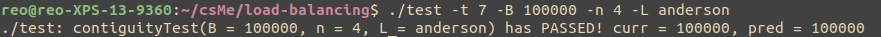
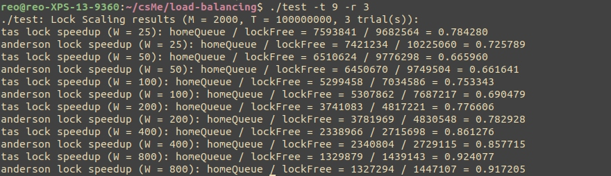

# Packet-Filtering Firewall Emulator

Load balancing of packet distribution system that emulates a packet-filtering firewall.

## Background

This is some text. Talk about different strategies, locks, workload (i.e. what the different parameters are). Talk about the different tests and experiments.

## Setup and Usage

Run `make` in the command line to have the makefile create two executables: `main` and `test`. `main` represents the actual program responsible for dispatching work, spawning threads, maintaining queues and locks, etc., whereas `test` allows the user to run (trials of) various customizable unit tests and experiments that all make use of the `main` executable and output human-readable data. While it is possible to run the load-balancer program directly via `main`, it is preferable to do so through `test`. Build and run the testing program as shown below:

```
$ make
$ ./test -t <testNo>
```

There are numerous other arguments that can be supplied, but `testNo` (used to specify a specific test *or* experiment) is the only one absolutely required for the program to run successfully. In most cases, all parameters needed for any particular test/experiment have default values; these can be altered by passing them as additional command-line arguments. Malformed or missing arguments to either program will fail to run the program and instead output instructive messages on proper usage. Run `test` with the `-h` argument to see all correct command-line arguments/options.

Run `make clean` to remove all object files and executables once you are done using the program(s).
Note that the efficiency/speedup of parallelizing work distribution/processing suffers when *threads* > *cores*. You can check the number of core(s) (i.e. CPUs) you have on your system by running `nproc`. **The main and test programs can take a while (i.e. several minutes) to complete execution, especially when running multiple trials or inputting parameters that stress the system -- please allow the programs ample time (within reason) to finish.**

## Sample Output





## Known Bugs

- Tests 3 and 4 (timedParallelTest and timedStrategyTest) have yet to be implemented. Attempting to run either test will do nothing, rather than throw an error.
- The workSteal strategy is a work in progress, and is hence faulty, likely resulting in non-termination (in which case, use `CTRL+C`). The workSteal strategy can technically be invoked directly via `main` and indirectly via `test` (through the workStealSpeedup experiment), but this is inadvisable.
